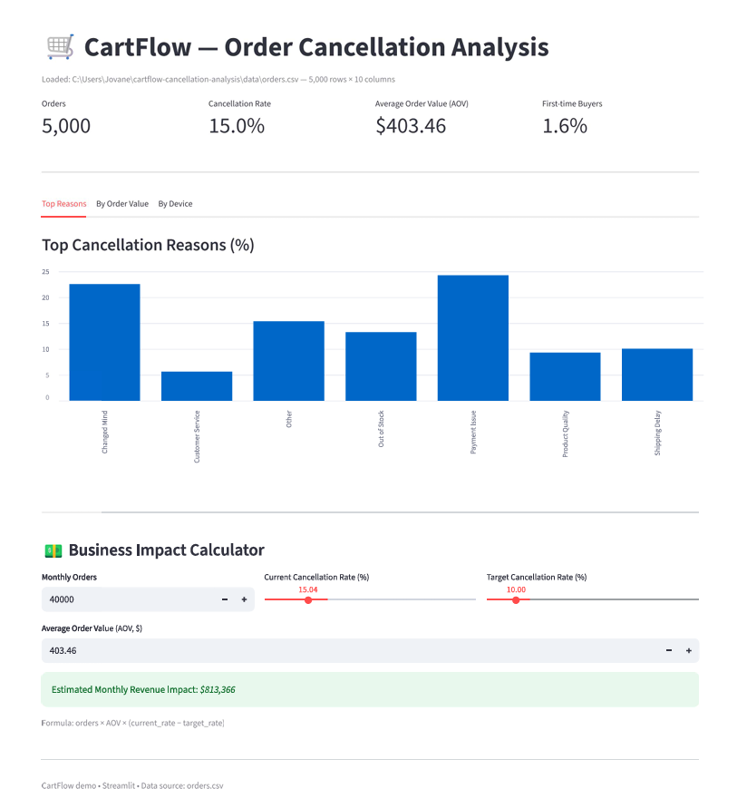

📦 CartFlow: Order Cancellation Analysis

   

📑 Table of Contents
Project Overview

Business Problem

Key Insights

Model Results

Tech Stack

Repository Structure

How to Run

License

📝 Project Overview
This end-to-end Data Analytics project analyzes e-commerce order cancellations to uncover patterns, quantify revenue loss, and propose actionable strategies to reduce cancellations.
The dataset includes simulated but realistic order data (orders.csv), enriched with imperfections to simulate real-world scenarios.

🎯 Business Problem
High order cancellation rates can significantly impact revenue and customer satisfaction. This project aims to:

Identify key drivers of cancellations

Quantify their financial impact

Propose strategies to improve retention and checkout conversion

📊 Key Insights
First-time customers cancel more often (22%)
Methodology: Segmented by customer_tenure_days (<30 days as first-time). Compared with returning customers: 22% vs. 12% cancellation rate.

Home products have the highest weekend cancellation rate (27%)
Methodology: Grouped by product_type and weekend/weekday using order_date. Found spike for "Home" during weekends, suggesting operational or stock issues.

Mobile users are 1.5× more likely to cancel
Methodology: Calculated cancellation rate by device_type and confirmed with chi-square test.

🤖 Model Results
Trained a Logistic Regression model using one-hot encoded features from EDA.

Accuracy: 0.84

ROC-AUC: 0.88

Top predictive features:

first_time_customer (+) → Higher probability of cancellation

device_type_Mobile (+) → Higher probability of cancellation

order_value (−) → Higher order value reduces probability

Methodology:

Train/test split (80/20)

Numerical features scaled with StandardScaler

Metrics: classification_report, confusion_matrix, roc_auc_score

Coefficient analysis for interpretation

🧰 Tech Stack
Languages & Libraries: Python 3.10, Pandas, NumPy, Matplotlib, Seaborn, Scikit-learn

Development: Jupyter Notebook, VS Code

Version Control: Git, GitHub

📂 Repository Structure
bash
Copy
Edit
cartflow-cancellation-analysis/
│
├── data/                  # [Datasets](data/)
├── images/                # [Generated visualizations](images/)
├── notebooks/             # [Jupyter Notebooks](notebooks/)
│   ├── 00_data_generation.ipynb
│   └── 01_eda_and_model.ipynb
├── outputs/               # Model outputs and reports
├── README.md              # Project documentation
├── requirements.txt       # [Dependencies](requirements.txt)
└── LICENSE                # [MIT License](LICENSE)
🚀 How to Run
Clone the repository:

bash
Copy
Edit
git clone https://github.com/<yojovane>/cartflow-cancellation-analysis.git
cd cartflow-cancellation-analysis
Install dependencies:

bash
Copy
Edit
pip install -r requirements.txt
Run notebooks in order:

00_data_generation.ipynb → Generates dataset

01_eda_and_model.ipynb → EDA & modeling

📜 License
This project is licensed under the MIT License.

